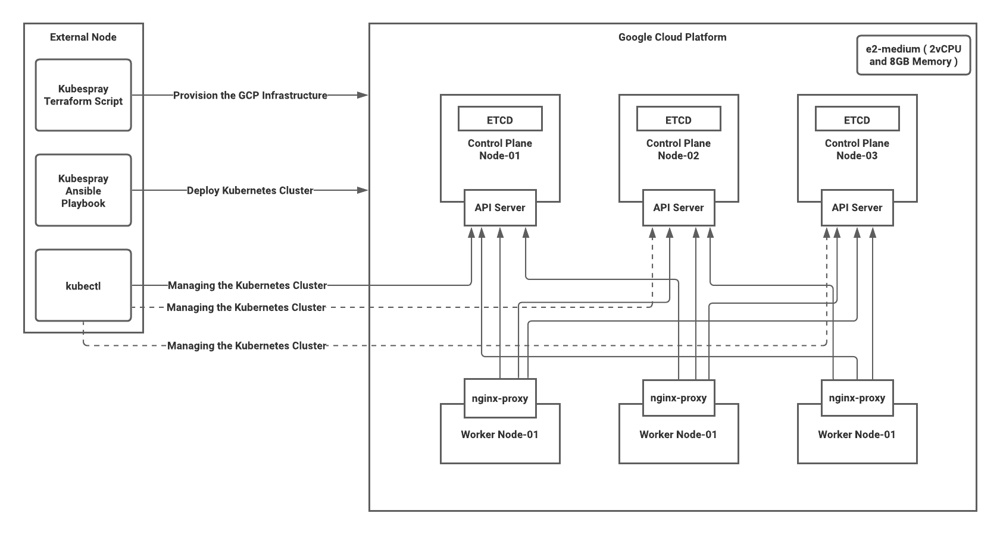
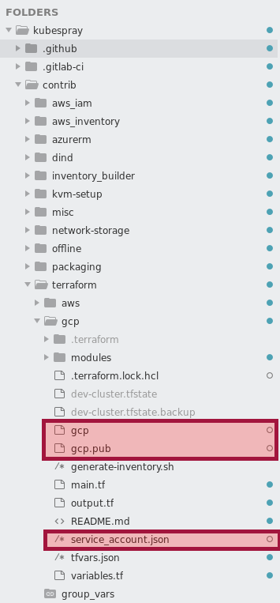
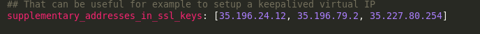
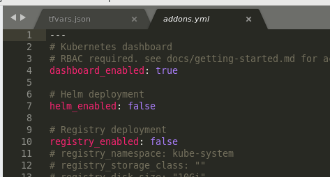

# Kubernetes Cluster Deployment with Kubespray
Below diagram depicts the setup that has been configured with this version of script.


| Component | Description |
| ------ | ------ |
| External Node | Host that will be the entry point of this execution from where scripts will be executed to remote |
| Kubespray Terraform Script | Used provision the needed servers in the Google Cloud Platform |
| Kubespray Ansible Playbook| [Used to deploy and configure the K8s Cluster in the provisioned servers |
| Kubectl | Kubectl client installed to manage the kubernetes Cluster from the External Node. |
| Google Cloud Platform | Servers were provisioned and for this setup it uses 3-Control Plane Nodes ( ETCD setup done within them ) and 3-Worker Nodes where the nginx proxy setup done for the communication between Worker to API servers happens in a load balanced way. |

# Step by Step guide to Setup the K8s Cluster

## Setting up the External Node
- Setup a VM or an External Node with Centos 7 ( You can use any but the steps and commands provided here based on Centos 7 )
Install git, this is to retrieve the kubespray code from git, the base of the extracted version is available at 
https://github.com/kubernetes-sigs/kubespray

- The updated configuration by extracting the tag v2.15.1 ( latest at this moment ) is pushed to https://github.com/MitraInnovationRepo/k8-cluster.git
```sh
sudo yum install git
git clone --recursive https://github.com/MitraInnovationRepo/k8-cluster.git
```
- Dependencies to Execute the pip commands
```sh
sudo yum install epel-release
sudo yum install python-pip
sudo yum install -y python3
pip --version
```
- Go to the kubespray directory and execute the below to install the dependencies that need to be installed to use the kubespray ansible playbook.
```sh
pip install -r requirements.txt
```
- Dependencies for Terraform Execution ( Provisioning the Servers in GCP )
```sh
sudo wget https://releases.hashicorp.com/terraform/0.15.1/terraform_0.15.1_linux_amd64.zip
sudo unzip ./terraform_0.15.1_linux_amd64.zip -d /usr/local/bin
terraform -v
```

- Google Cloud Access from External Node Setup

Setup the private and public key pair ( this is used when creating the servers in GCP by the script and also when ssh to GCP servers we need this )
```sh
Go to kubespray/contrib/terraform/gcp and execute 
ssh-keygen
```
Credentials to login to Google Cloud Platform, need to use service account credentials here I'm using the default login credentials.
```sh
gcloud auth application-default login --no-launch-browser
```
then go to  cat /home/sl-ajanthan/.config/gcloud/application_default_credentials.json and fetch the credentials.
```sh
Eg: Credentials
{
  "client_id": "764086051850-6qr4p6gpi6hn506psasajuq83di341hur.apps.googleusercontent.com",
  "client_secret": "d-FL95Q19q7MQmFpd7asasa0Ty",
  "refresh_token": "1//0g4RXkG3sYVLDCgYIARAAGBASNwF-L9Irdaasas-kIhFRsJFc9johGcqFwNvLzVzHBttMpe6QsMXXagJOFJ55Jm57vcv_4z2i326k",
  "type": "authorized_user"
}
```
- now go to the GCP terraform script folder ( kubespray/contrib/terraform/gcp ) and create a file service_account.json and save the credentials there.



## Executing the GCP Provisioning

- Updates to Scripts
Go to kubespray/contrib/terraform/gcp/tfvars.json and can update the variables and specifically if we need more nodes then can be added under the machines section and preferred OS also can be specified.

- Execute the Below scripts to provision the servers to GCP.
```sh
terraform init
terraform plan -var-file tfvars.json -state dev-cluster.tfstate
terraform apply -var-file tfvars.json -state dev-cluster.tfstate
```
```sh
A Successful Deployment will display the below 

Apply complete! Resources: 33 added, 0 changed, 0 destroyed.

Outputs:

control_plane_lb_ip_address = "34.74.115.58"
ingress_controller_lb_ip_address = "35.237.38.50"
master_ips = {
  "development-master-0" = {
    "private_ip" = "10.0.10.5"
    "public_ip" = "35.231.235.145"
  }
  "development-master-1" = {
    "private_ip" = "10.0.10.2"
    "public_ip" = "35.196.64.91"
  }
  "development-master-2" = {
    "private_ip" = "10.0.10.4"
    "public_ip" = "35.243.184.228"
  }
}
worker_ips = {
  "development-worker-0" = {
    "private_ip" = "10.0.10.3"
    "public_ip" = "35.196.172.78"
  }
  "development-worker-1" = {
    "private_ip" = "10.0.10.7"
    "public_ip" = "34.73.45.152"
  }
  "development-worker-2" = {
    "private_ip" = "10.0.10.6"
    "public_ip" = "34.75.212.11"
  }
}
[devuser@localhost gcp]$ 
```
Here there are two IPs at the start 
control_plane_lb_ip_address = "34.74.115.58"
ingress_controller_lb_ip_address = "35.237.38.50"
These are not needed for now and if needed can be removed from the script.

## Executing the Kubespray Cluster Deployment Scripts

- Add a dependency
```sh
sudo pip3 install ruamel_yaml
```
- Generate the host.yaml file
```sh
cp -rfp inventory/sample inventory/devcluster
```
- Specify all the IP addresses of the nodes which are going to be used for the deployment.
```sh
declare -a IPS=(104.196.12.73 35.237.22.123 35.237.183.136 35.231.93.125 34.73.48.18 35.229.55.143)
```
- Then execute the below:
```sh
CONFIG_FILE=inventory/devcluster/hosts.yaml KUBE_MASTERS=3 python3 contrib/inventory_builder/inventory.py ${IPS[@]}
```
This will generate the hosts.yaml with 3-master nodes. After this file generated this can be modified based on our need and also make sure you are doing the below:

- Remove the access_ip and here we need separate worker nodes 3 so need to remove the other nodes that were assigned to the worker. Eg output will come as below:
```sh
all:
  hosts:
    node1:
      ansible_host: 35.196.24.12
      ip: 10.0.10.2
    node2:
      ansible_host: 35.196.79.2
      ip: 10.0.10.5
    node3:
      ansible_host: 35.227.80.254
      ip: 10.0.10.3
    node4:
      ansible_host: 104.196.129.172
      ip: 10.0.10.4
    node5:
      ansible_host: 35.227.2.39
      ip: 10.0.10.7
    node6:
      ansible_host: 34.73.75.224
      ip: 10.0.10.6
  children:
    kube-master:
      hosts:
        node1:
        node2:
        node3:
    kube-node:
      hosts:
        node4:
        node5:
        node6:
    etcd:
      hosts:
        node1:
        node2:
        node3:
    k8s-cluster:
      children:
        kube-master:
        kube-node:
    calico-rr:
      hosts: {}
```
- Go to kubespray/inventory/devcluster/group_vars/k8s-cluster/k8s-cluster.yml

This is to update the accepted hosts ( specify master host ips ) in the certificate, this will allow access to the kube cluster through kubectl from remote the server using the kubeconfig file.

- Also to enable the Kubernetes dashboard /inventory/devcluster/group_vars/k8s-cluster/addons.yml


- Executing the Ansible Playbook

- Make sure the private key have specific needed permission
```sh
sudo chmod 600 contrib/terraform/gcp/gcp
```
- When using the servers for the first time, they need to accept the hosts as authorized. Execute the below for each server ips.
```sh
ssh-keygen -f /home/devuser/.ssh/known_hosts -R 35.196.172.78
ssh -i contrib/terraform/gcp/gcp ubuntu@35.196.64.91
```
- Execute the Cluster Setup Script
```sh
ansible-playbook -i inventory/devcluster/hosts.yaml --become --user=ubuntu cluster.yml --private-key=contrib/terraform/gcp/gcp
```
> This will take around 45 minutes to get deployed.


